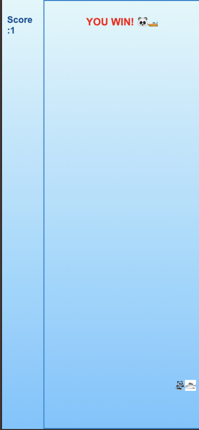
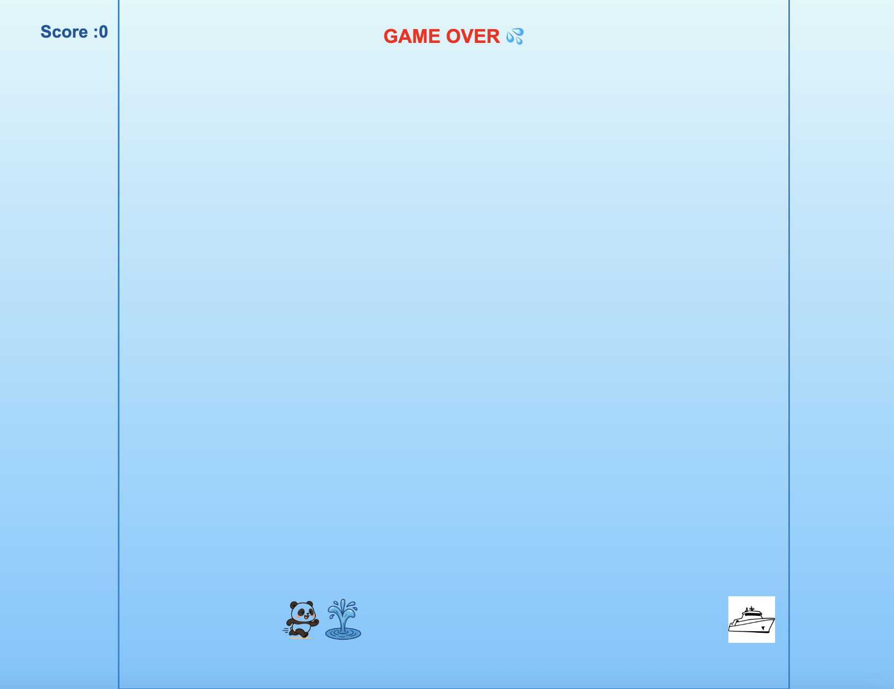

# Panda Jumping Game 🎮

# Objective

This repository is basically just a jumping game model 2D that allows you to easily understand how the mechanics work. 

## Stack

Used technologies:

### Features

HTML5 provides the semantic structure:

 < main > → game container

< header > → live score( < output >)

< section > → play area with the panda (player), spour water (obstacle), and yatch (goal).

 → game-over message
 → easy instructions 

CSS3 handles the layout and visuals: Background gradient for the water/sky

Panda, boat, and fountain displayed as images (background: url ( ...) )

Positioning: Flex, rAF , TOTAL_LAPS, responsivness.

JavaScript manages the game logic:

Variables for player, obstacle, goal, score, game speed

A jump function that makes the panda jump with requestAnimationFrame (rAF). 
A loop that moves the spour water across the screen.

👩🏽‍💻 Capturing Events.

Collision detection: if the panda hits the spour water → Game Over

Win condition: if the panda reaches the yatch → You Win!

The loop:  * Moves the obstacle * Checks collisions * updates score/game state. 

Fully responsive as we use relative size in css.

This model is intentionally simple, so you can follow along and understand how the different parts (HTML for structure, CSS for style, JS for behaviour - ) alligned together to create a fancy 2D mini-game.

# Views 

Some of the views can be seen  below: 

# Future improvements 

Summary in a nutshell:

- Levels with speed scaling → for challenge.

- Lives + animations → for fun & fairness.

# Collaborators 
- Maricode-40/ Marissa Rico Developer 
- Shalom Alalade Developer 

# Deploy 🚀 🚀 
 🎮 Live Demo 
👉 [**Click here to play the game!**](https://maricode-40.github.io/panda-jumping-game-mayerfeld-final/)

